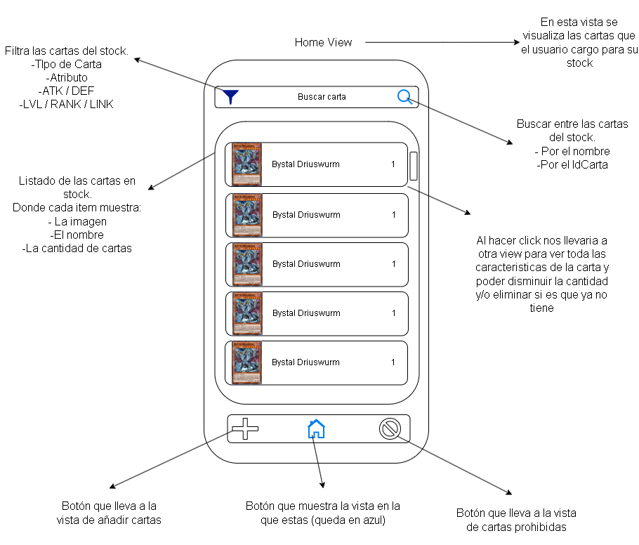
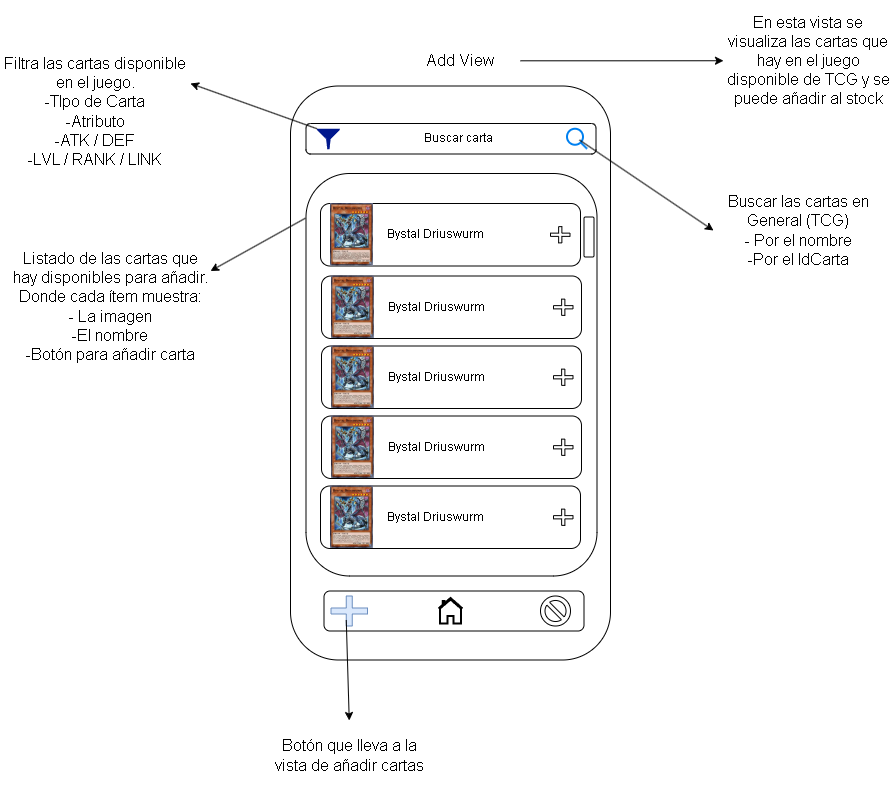
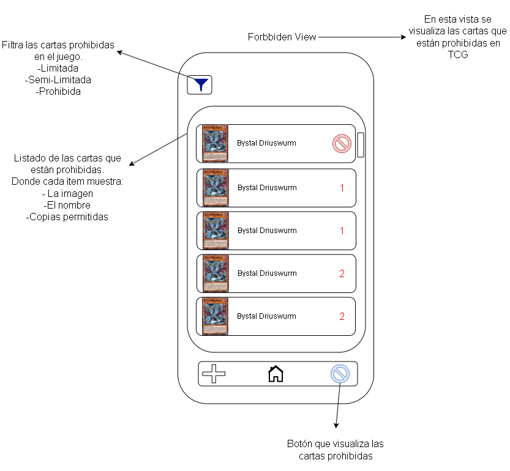
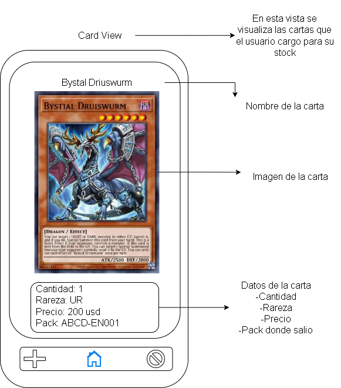

# Yu-Gi-Oh Stock HD

Una aplicacion movil la cual podras llevar un registro de las cartas que tienes.

## Bocetos de la Aplicacion

### Home View
"Home View" sera la pantalla de inicio en la cual observara el usuario las cartas que tenga.

### Add View
"Add View" se podra añadir la carta que posee el usuario haciendo click en el simbolo de "+" las cantidad de veces que quiera para poder añadir la cantidad que tenga.

### Forbidden View
"Forbidden View" mostrara todas las cartas baneadas, limitadas y semi-limitadas que hay en el juego de YuGiOh TCG.

### Card View
"Card View" mostrara todos los detalles de la carta que tenga y ademas se podra eliminar si es que el usuario no tiene mas dicha carta o decrementar su cantidad.

## Fecha de Actualizacion
- 29/05/2025 (Se agrega documentacion).

## Desarrolladores

- Henry Ferreira.

- Dáriel de Sosa.